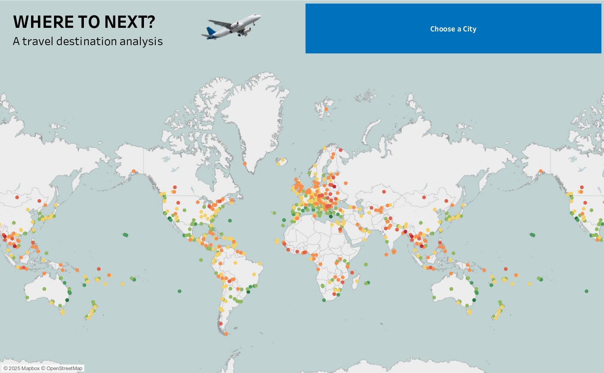
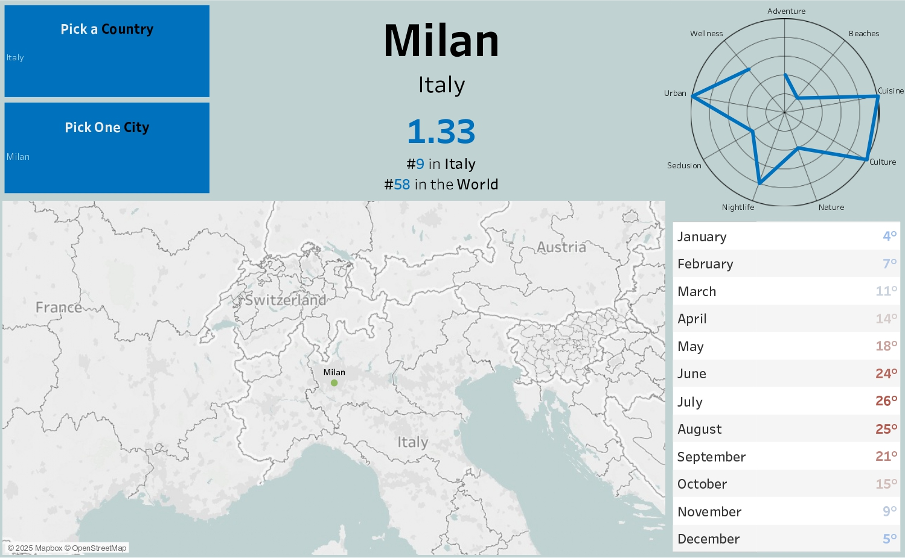
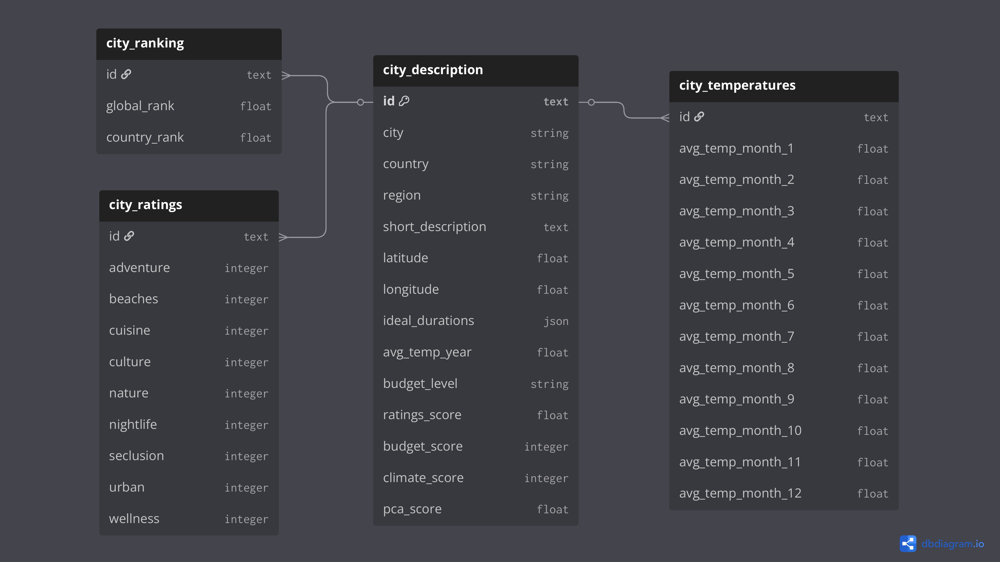

# Where to next?

<table>
  <tr>
    <td></td>
    <td></td>
  </tr>
</table>

## A Travel Destination Analysis

Picking the right travel destination is a tough process that involves balancing multiple different factors. 

This project uses Principal Component Analysis (PCA) and data visualisation to objectively rank over 500 global cities using three essential travel criteria:
- Budget – average cost for the trip
- Climate – average temperature over the year
- Ratings – traveler satisfaction scores across multiple categories

PCA reduces this multi-dimensional dataset into two quantifiable variables, in order to statistically rank cities through a balance of all factors. 

## Data Overview

### Data Sources

The dataset aggregates public data from a travel review [website](https://www.kaggle.com/datasets/furkanima/worldwide-travel-cities-ratings-and-climate).

### Data Cleaning & Preparation

.json files were made into columns and non-existing countries were added to existing ones ([python code](code/cities_cleaning.py)), then [data exploration](code/cities_exploration.ipynb) was carried out for dataset familiarization purposes. Ultimately, data preparation for visualization was conducted in [python](code/cities_preparation.py).

### Data Structure

The final dataset is stuctured as follows:

  

### Data Visualization

Visualizations were created in Tableau Public, accessible here.

### Data Limitations
- No travel restrictions or visa related issues
- Data is limited to yearly temperatures, it does not consider seasonality
- Ratings categories are arbitrary do not account for each singular travelers' preferences

## Key Questions

1.	Which cities rank highest and lowest overall when budget, ratings, and climate are considered together?
2.	What characteristics do top-ranked cities share?
3.	What characteristics do bottom-ranked cities share?

## Key Findings

The PCA transformation revealed clear patterns among global travel destinations:
- Top 10 Cities:
	- Highest-rated travel destinations stood out for combining excellent traveler ratings with strong climate scores.
	- Notably most of the top-rated cities fall into the most expensive budget level, but they make up for it with excellent weather while holding ratings > 3.6.

- Bottom 10 Cities:
	- Bottom 10 cities scored low due to poor climate (scores 1–5) and low traveler satisfaction.
	- Many bottom-ranked cities had the highest budget score (3), signaling low cost, but this wasn’t enough to compensate for unfavorable weather or mediocre reviews.
 
| Rank | City             |   Score   | Budget        | Climate        | Ratings        |
|------|------------------|-----------|---------------|----------------|----------------|
| 1    | Sydney           | +3.98     | 1             | 8              | 3.89           |
| 2    | Florianópolis    | +3.68     | 2             | 10             | 3.89           |
| 3    | Los Angeles      | +3.66     | 1             | 8              | 3.78           |
| 4    | Crete            | +3.61     | 2             | 8              | 4.11           |
| 5    | Antalya          | +3.32     | 2             | 9              | 3.89           |
| 6    | San Diego        | +3.29     | 2             | 8              | 4.00           |
| 7    | Honolulu         | +3.24     | 1             | 5              | 4.00           |
| 8    | Hamilton         | +3.04     | 1             | 9              | 3.44           |
| 9    | Gold Coast       | +3.03     | 2             | 10             | 3.67           |
| 10   | Funchal          | +3.03     | 2             | 10             | 3.67           |
| -    | -                | -         | -             | -              | -              |
| 551  | Pristina         | –3.34     | 3             | 5              | 2.44           |
| 552  | Yamoussoukro     | –3.37     | 3             | 4              | 2.56           |
| 553  | Chisinau         | –3.37     | 3             | 4              | 2.56           |
| 554  | Astana           | –3.42     | 2             | 1              | 2.56           |
| 555  | Tartu            | –3.43     | 3             | 2              | 2.78           |
| 556  | El Chaltén       | –3.47     | 3             | 1              | 2.89           |
| 557  | Dhaka            | –3.69     | 3             | 4              | 2.44           |
| 558  | Minsk            | –3.72     | 3             | 3              | 2.56           |
| 559  | Phnom Penh       | –4.11     | 3             | 1              | 2.67           |
| 560  | Naypyidaw        | –4.66     | 3             | 4              | 2.11           |

> Cost is important—but only when combined with comfort and enjoyment.

> Climate score was a dominant factor for these rankings (bottom-10 climate score ≤ 5, top-10 climate score ≥ 8).

> On a microscopic level, travel is deeply personal. But on a macroscopic level, data can suggest objectively better travel destinations overall.

## Assumptions and Caveats
- 3-Factor PCA is useful, but to get a bigger picture with more exhaustive results more categories are needed.
- Climate score is based on yearly averages, not seasonal or even monthly, nevetheless this completely ignores personal preference (depending on the cases: cold > warm).
- This 560-city database does not factor in the current state of events (wars, political imbalances, epidemics, etc.).
